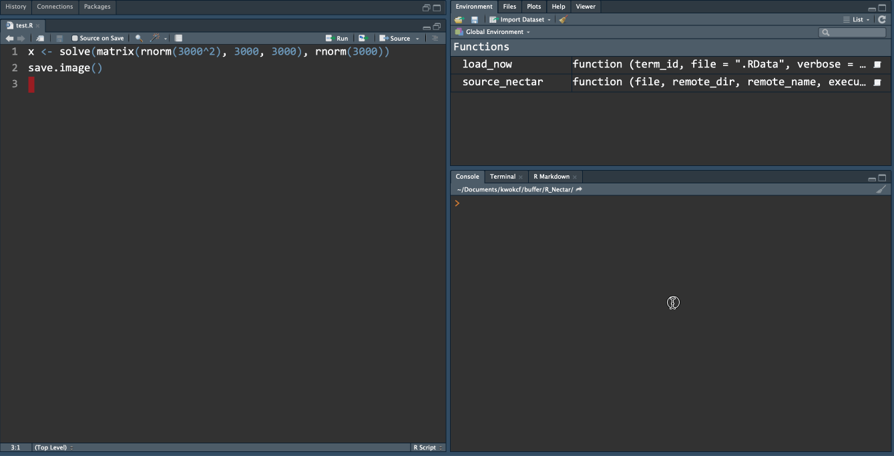

```{r setup, include=FALSE}
knitr::opts_chunk$set(echo = TRUE, eval = FALSE)
```

# Demo



# 1. Set up Nectar

i. Log-on to [NectarCloud](https://dashboard.rc.nectar.org.au/). For researchers in Australia, use "Australian Log in via AAF" and search for your organisation. 

ii. Once you are at the dashboard, go to the 'Instances' tab (on the left), then click the "Launch instance" button (on the right) and follow the instructions.

    - The "NeCTAR Debian 9 (Stretch) amd64" image is recommended
    - Make sure to enable ssh and https (a SSH key-pair needs to be generated if you have not done so before.)

iii. Once the instance is launched, you may then connect to the Nectar server using `ssh`. Instructions can be found [here](https://support.ehelp.edu.au/support/solutions/articles/6000055446-accessing-instances). If you had experience with `ssh` before, then this slide would give a good summary of what you need:


Note that 

- the keyfile is usually located at `~/.ssh/`.
- the image name can be found [here](https://support.ehelp.edu.au/support/solutions/articles/6000106269-image-catalog#username). For debian image, it's just 'debian'.
- the ip address can be found at the instance tab of the dashboard.

<!-- 
#### Personal remark
Nectar has reached a state I would recommend to colleagues looking for some extra computing power. The main advantage over other commerical cloud services is that there are fewer barriers, e.g. 

- no billing. You do not need to worry about the cost and setup credit cards, usage caps, notifications, etc.

- no specialised SDK. If you had experience using computer cluster, then Nectar should work just as you expect.

- only one engine conceptually, and you do all the work to customise to your need. It might sound like a disadvantage as other services would have customised for you different engines for specialised use. But sometimes it can be daunting just to find out what engines does what (and the APIs that come with them). I believe production-level work should use production-level system, and simple work should use simple system. Nectar would be a good fit if you merely want an extra computer that runs some script (R code, Python code, etc.) and returns the result once it is done.
 -->

---

# 2. Set up R on a fresh Debian server

Reference: https://cran.r-project.org/bin/linux/debian/

## i. Install basic Linux tools
```
sudo apt-get install software-properties-common vim apt-transport-https
```

## ii. Add CRAN repository to apt-get
(This is needed to get the latest version of R.)

```
sudo apt-get update
sudo add-apt-repository 'deb https://cran.ms.unimelb.edu.au/bin/linux/debian stretch-cran35/'
```

- One may choose other repository listed at https://cran.r-project.org/mirrors.html.
- FYI: the apt-repository list is stored at 'etc/apt/sources.list'

## iii. Add public key for the CRAN repository
The following is a summary of the instructions given at https://cran.r-project.org/bin/linux/debian/.

1. Go to http://keyserver.ubuntu.com/
2. Lookup `Johannes Ranke <jranke@uni-bremen.de>`
3. Click the corresponding link that starts with `pub`
4. Copy the text (including headers but exclude the html title) into a file, say 'jranke.asc' (this is where you use `vim`)
5. Run `sudo apt-key add jranke.asc`

## iv. Install the latest verison of R
```
sudo apt update
sudo apt install r-base-dev r-base
```

It is recommended to install OpenBLAS to enable multi-thread computation in R.
```
sudo apt-get install libopenblas-base
```

## v. Install the `tidyverse` package
```
sudo apt-get install libcurl4-openssl-dev libssl-dev libxml2-dev
```
```{r}
# in R
install.packages("tidyverse")
```


---

# 3. Set up Pipeline to connect R and Nectar

Reference: https://en.wikibooks.org/wiki/OpenSSH/Cookbook/Multiplexing

## a. The Pipeline
Recall that what we want to achieve is to push some R code to the cloud, run it there and then fetch the result back. Suppose we have some R code:

```{r}
# test.R
x <- 99999
save.images()  # generate a .RData file
# save(x, file = '.RData')  # save a particular object
```

Suppose the remote address is `debian@123.123.123.123` and a folder `Documents/test_folder/` is created there (and the SSH key is stored locally at `~/.ssh/nectar`), then all we need is three lines of bash command: 
```
scp -i ~/.ssh/nectar test.R debian@123.123.123.123:~/Documents/test_folder && \
  ssh -i ~/.ssh/nectar debian@123.123.123.123 "cd Documents/test_folder/ && Rscript test.R" && \
  scp -i ~/.ssh/nectar debian@123.123.123.123:~/Documents/test_folder/.RData ./.RData
```
(*Careful that the command overwrites the .RData at the working directory if there is already one.)

In general form, it looks like this:
```
scp -i {key-file} {R-file} {remote-working-dir} && \
  ssh -i {key-file} {remote-address} "cd {remote-working-dir} && Rscript {R-file}" && \
  scp -i {key-file} {remote-working-dir}/.RData ./.RData
```

- The `scp` command copies file from and to the remote server.
- The `ssh` command followed by the double-quoted bash command changes to the right directory and calls the `Rscript` command.

While this works, if you actually run it, you'll realise you are prompted for password three times, one time for each command. This is undesirable, which leads us to consider the following setup.

## b. Improve Efficiency

### Using `ssh` configuration file

<!-- (I must confess that I am reluctant to touch the `~/ssh/config` file at the beginning, but there does not seem to be an alternative!) -->

Add the following entry to the `~/ssh/config` file:

```
Host myNectar
  Hostname 123.123.123.123
  User debian
  ControlMaster auto
  ControlPath ~/.ssh/cm-%r@%h:%p
  IdentityFile ~/.ssh/nectar
```

- `Host` is the 'nickname' you give to the remote server.
- `Hostname` is the address of the server.
- `User` is the username (which is the image name in our case).
- `ControlMaster` being 'auto' checks if there is already an active connection to the remote server, if so, the subsequent connections are tunnelled using the existing connection. If not, a new connection is created and made as the master connection. This allows multiple sessions to be run over a single network connection, i.e. the password is only needed once.
- `ControlPath` is a way to name the master connection. This is needed for the subsequent connections to work without password.
- `IdentityFile` is the keyfile you use to log-on to the server.


### New Workflow
Once the configuration is setup, you may connect to the server with `ssh myNectar`. While this connection is alive, you may then start a new terminal and run other `ssh` / `scp` commands without re-entering the password. So the workflow becomes
(At the first terminal)
```
ssh myNectar
```
Then at a new terminal
```
scp test.R myNectar:~/Documents/test_folder && \
  ssh myNectar "cd Documents/test_folder/ && Rscript test.R" && \
  scp myNectar:~/Documents/test_folder/.RData ./.RData
```

After the work is done, call `exit` at the first terminal.

### Notes
- The command `ssh -O check myNectar` checks if the master connection `myNectar` is alive.
- It is handy to use terminal in `RStudio`.


## c. Taking advantage of RStudio terminal facilities

```{r}
#' Source a R file using Nectar computing cluster
#' @param file The R file to run.
#' @param remote_dir The remote directory to copy the file to.
#' @param remote_name The remote hostname.
#' @param execute T or F; whether to launch a terminal and run the code.
source_nectar <- function(file, remote_dir, remote_name, execute = T) {
  dname <- dirname(file)
  cmd <- glue::glue(
    "scp {file} {remote_name}:~/{remote_dir} && \
    ssh {remote_name} 'cd {remote_dir} && Rscript {file}' && \
    scp {remote_name}:~/{remote_dir}.RData {dname}/.RData"
  )
  if (execute) {
    term_id <- rstudioapi::terminalExecute(cmd, workingDir = getwd())
    cat("Code launched at terminal '", term_id, "'.\n", sep = "")
    return(term_id)
  }
  invisible(NULL)
}


#' Load an image file
#' @description The function checks if the process has ended using the terminal exit code.
#' @param term_id The terminal id.
#' @param file The image file.
#' @param verbose Should item names be printed during loading?
#' @param clean_file Should the image file be removed after it is loaded?
#' @param clean_terminal Should the exited terminal be removed?
load_now <- function(term_id, file = ".RData", verbose = T, 
                     clean_file = F, clean_terminal = T) {
  if (is.null(rstudioapi::terminalExitCode(term_id))) {
    cat("Result is not ready.\n")
    return(invisible(NULL))
  } 
  if (!file.exists(file)) {
    cat("Process ended but file does not exist.\n")
    return(invisible(NULL))
  } 
  
  load(file, verbose = verbose, envir = globalenv())
  if (clean_file) invisible(file.remove(file = file))
  if (clean_terminal) rstudioapi::terminalKill(term_id)
}
```

```{r}
# Usage
# call `ssh myNectar` at RStudio terminal first
id <- source_nectar("test.R", "Documents/test_folder/", "myNectar")
load_now(id, clean_file = T)
```
